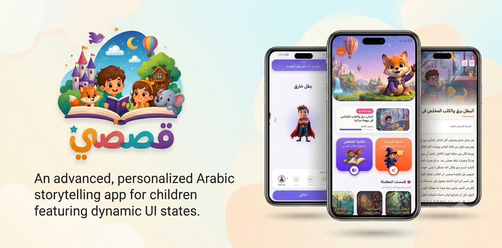
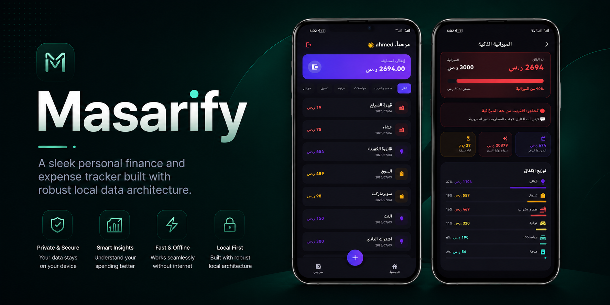
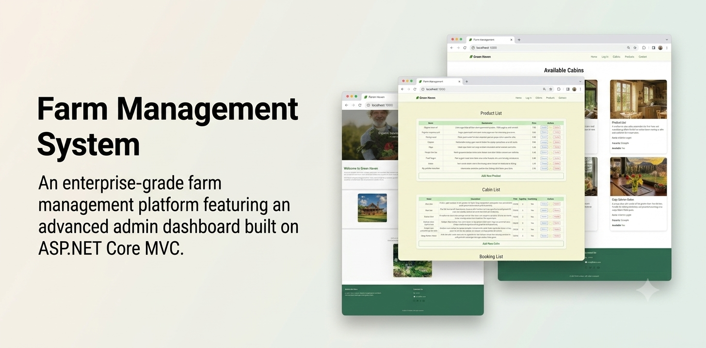
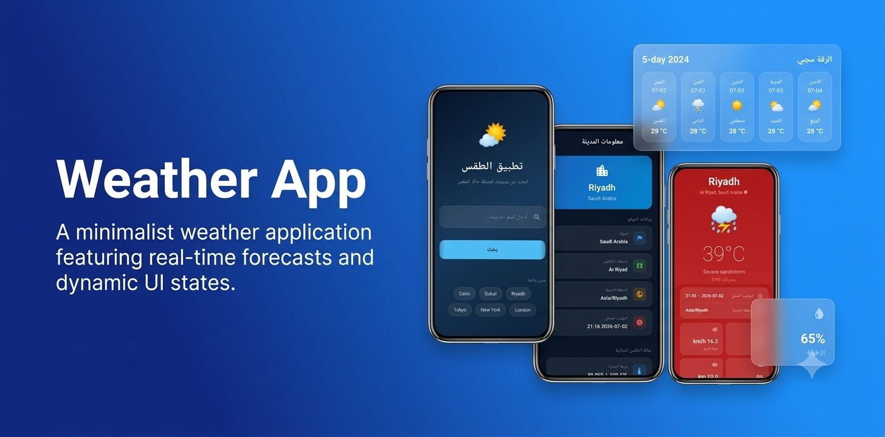

<h2> 👋Hello! I'm Rinad </h2>

Computer Science graduate passionate about building seamless and efficient full-stack web and mobile applications.

I focus on creating user-centric experiences and am constantly exploring new frontiers in AI and data analytics.

## 🛠️ Tech Stack

### Languages & Core

 

### Frameworks & Technologies

### Tools & Platforms

## 🚀 Featured Projects

### 📖 Qisasi

  

Offline-first Arabic storytelling app with rule-based recommendation engine and text-to-speech narration.

---

### 💸 Masarify

  

Offline finance tracker with clean architecture and SQLite database.

---

### 🌿 Farm Management System

  

Full-stack web system using ASP.NET Core and SQL Server.

---

### 🌤️ Weather App

  

Flutter weather app consuming REST APIs with reactive state management.

## 📊 GitHub Stats

  

## 📫 Connect with Me

